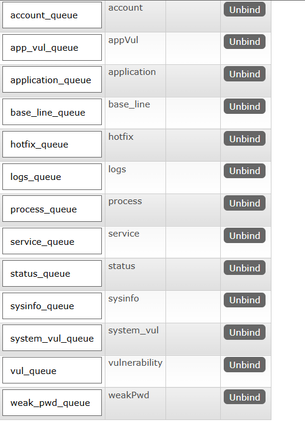

平台端
java17,mybatis,springboot3.0.2, mysql8+, redis,rabbitmq

客户端
python10+

redis，mybatis, rabbitmq配置信息在src/main/resources/application.properties更改

rabbitmq中的队列

红框的是自动创建，不用管

agent_exchange注意类型为direct

sysinfo_exchange中的绑定键

